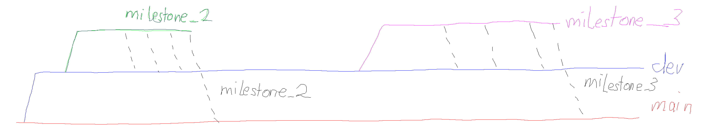

# S6-deep-learning

## Group Members
- [Jonas Pollpeter](https://github.com/JonasPTFL)
- [Julius Emil Arendt](https://github.com/Aremju)

## Preprocessing

### Preprocessing steps for the food-101 dataset
Link to **food-101** dataset: [https://www.kaggle.com/datasets/dansbecker/food-101](https://www.kaggle.com/datasets/dansbecker/food-101)

General information about generated files:
> [`chosen_classes.txt`](./chosen_classes.txt) is used to determine which classes to keep
> 
> [`removed_images.txt`](./removed_images.txt) is used to determine which images to delete

Steps for preprocessing:
1. download the dataset from the link above
2. unzip the dataset to directory `dataset`
3. path variables for the dataset paths are set in the [`constants.py`](src/util/constants.py) file
4. [`class_selection.py`](src/preprocessing/class_selection.py) is used to select a random subset of classes from the 
dataset and store the directory names of those classes as a list in [`chosen_classes.txt`](./chosen_classes.txt)
5. [`deletion_image_classes.py`](src/preprocessing/deletion_image_classes.py) updates the local dataset by deleting all
classes that are removed from the dataset in class reduction process.
6. [`deletion_image_files.py`](src/preprocessing/deletion_image_files.py) is used update the local dataset by deleting all
images that are removed from the dataset in data cleaning process

## Folder Structure

```
project_name/
│
├── dataset/
│   └── food-101/
│       └── images/
│           └── ...
│── docs/
│   └── ...
├── models/
│   ├── saved_model/
│   └── checkpoints/
├── notebooks/ 
│   └── ...
├── src/
│   ├── preprocessing/
│   │   └── ...
│   ├── model_code/
│   │   └── ...
│   └── utils/
│       └── ...
├── chosen_classes.txt
├── removed_images.txt
└── README.md
```

## Branching Structure



## Issue: Wrongly allocated memory

If an error occurs which says something like being unable to allocate X GiB of memory,
please make the following changes on your IDE (Pycharm only):

Make sure you have this environment variable in your 
run-config:

```markdown
XLA_FLAGS=--xla_gpu_strict_conv_algorithm_picker=false
```

It will remove that issue, hence it will decrease your 
model's performance a little bit.